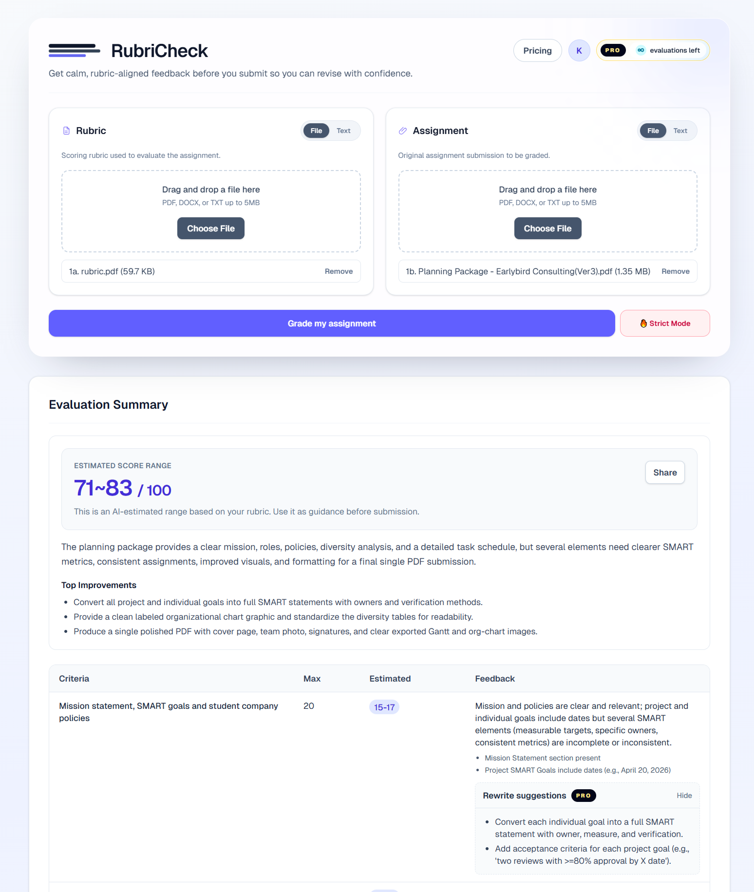

  

<h1 align="center">RubriCheck</h1>

  AI rubric grading assistant for students, tutors, and educators.

  Turn a rubric and an assignment draft into structured scoring criteria, estimated score ranges, and clear revision priorities.

  <a href="https://rubricheck.com"><strong>Visit rubricheck.com</strong></a>

  

## Overview

RubriCheck is a web product that helps users review assignment drafts before final submission.

Instead of manually comparing a paper against a long rubric, users can upload or paste both the rubric and the assignment. RubriCheck then structures the rubric, evaluates the draft criterion by criterion, estimates a score range, and highlights the most important next revisions.

This project was also built as a portfolio piece: not just a UI demo, but an end-to-end AI product with real input handling, rate limits, monetization flows, and production-oriented guardrails.

## Why It Matters

- Rubrics are often long, inconsistent, and difficult to use for self-review.
- Students want fast, actionable feedback before submission.
- Educators and tutors need a lightweight way to preview rubric alignment without manually scoring every draft.

RubriCheck focuses on practical feedback:

- structured rubric criteria
- criterion-level score estimates
- concise feedback per criterion
- top improvement priorities
- optional Pro flows for deeper usage

## Core Experience

### 1. Submit rubric and assignment

Users can:

- upload `PDF`, `DOCX`, or `TXT`
- paste rubric text directly
- paste assignment text directly

### 2. Convert rubric into structured criteria

The app turns messy rubric text into a machine-readable grading structure so later evaluation can be consistent and predictable.

### 3. Evaluate the draft against the rubric

RubriCheck returns:

- overall estimated score range
- criterion-by-criterion feedback
- evidence-aware reasoning
- top 3 revision priorities

### 4. Share and iterate

Users can review the result, export a shareable summary image, and revise before submitting their real assignment.

## Product Highlights

- AI-assisted rubric structuring and draft evaluation
- Standard mode and Strict mode for different grading expectations
- File parsing pipeline for `PDF`, `DOCX`, and `TXT`
- Usage limiting with Upstash Redis
- Pro / paid feature surface for rewrite and expanded access
- Stripe checkout and entitlement recovery flow
- Shareable results image generation

## Tech Stack

RubriCheck was designed as a practical SaaS-style AI product rather than a prototype.

- Frontend: `Next.js App Router`, `React 19`, `TypeScript`, `Tailwind CSS 4`
- Backend: `Next.js Route Handlers`
- AI integration: `OpenAI API`
- Validation: `Zod`
- File parsing: `pdf-parse`, `mammoth`
- Billing: `Stripe`
- Rate limiting and lightweight session data: `Upstash Redis`
- Data / billing ledger: `Supabase Postgres`
- Deployment and monitoring: `Vercel Analytics`, `Vercel Speed Insights`

## What This Project Demonstrates

As a portfolio project, RubriCheck shows experience across both product thinking and implementation:

- turning an education workflow into a focused SaaS product
- designing AI output around structured, usable results instead of raw generation
- handling real-world edge cases like file validation, usage limits, and entitlement restoration
- connecting product UX with billing, access control, and deployment concerns
- building a clean end-to-end flow from landing page to evaluation result

## System Flow

1. User submits a rubric and assignment draft.
2. The server validates files and input size.
3. The rubric is converted into structured grading criteria.
4. The draft is evaluated against each criterion.
5. The response is normalized into score ranges, feedback, and improvement priorities.
6. The UI renders a result that is easy to review and share.

## Live Product

- Website: https://rubricheck.com
